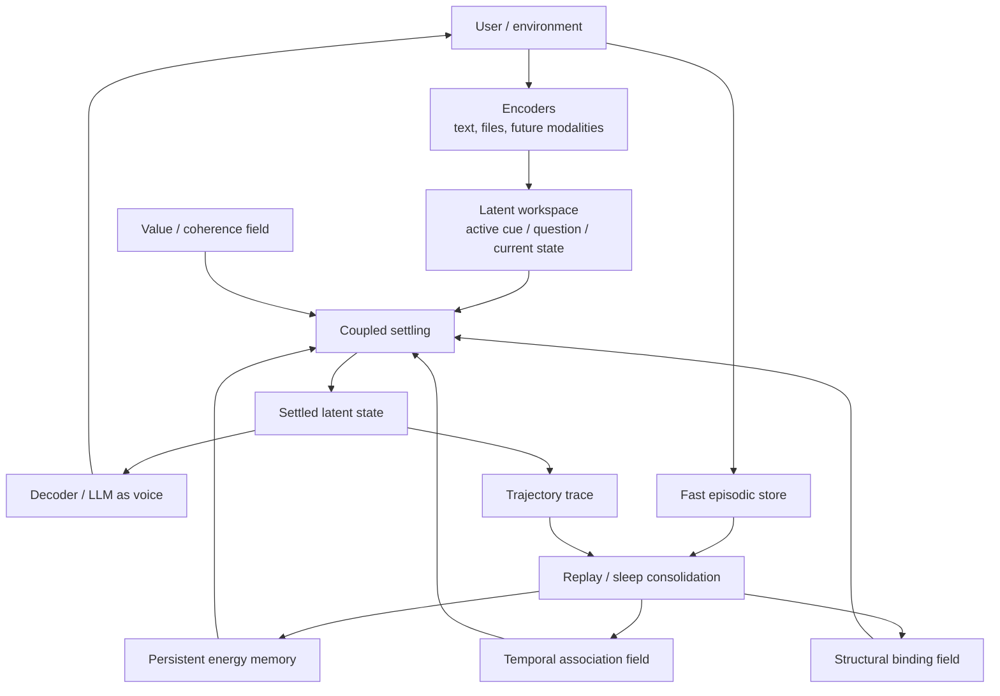

# Neuro-AI Project Plan

## One-Sentence Goal

Build a local, memory-first AI substrate that can continuously learn from lived
experience, remember by association, reason in latent energy space, and use an
LLM only as an interface rather than as the cognitive core.

## First Principles

The project is not trying to build a better chatbot wrapper. It is trying to
build a persistent cognitive substrate.

Core commitments:

- **No controller:** no supervisory module decides what matters, which mode to
  use, or when to switch strategies. Apparent decisions should be expressed as
  local geometry, energy, settling, tension, or consolidation dynamics.
- **Memory is the self:** the durable system identity lives in the learned
  landscape and its trajectories, not in frozen LLM weights.
- **Contextual completion over token prediction:** the native question is "what
  does this remind the system of, and what fills this unresolved gap?"
- **Continuous learning:** live experience writes traces; replay consolidates,
  abstracts, and reshapes the landscape.
- **Latent reasoning:** reasoning should happen in vectors/energy states before
  language is generated.
- **Energy efficiency:** use compact latent operations, sparse active memory,
  replay, and MPS acceleration instead of large autoregressive decoding loops.
- **Local-first:** the working research system should run on a MacBook Pro class
  machine.

## Proposed Architecture



## Energy Terms

The long-term target is a coupled energy function:

```text
E_total =
  E_content      pattern compatibility with stored experience
+ E_temporal     compatibility with lived before/after context
+ E_structure    role, position, binding, and relation consistency
+ E_world        predictive coherence of latent transitions
+ E_value        usefulness / user-aligned value / task progress
+ E_novelty      unresolved but engaged regions stay active
+ E_stability    anti-collapse and anti-forgetting pressure
```

No term should become a hidden controller. Each term is a geometric pressure on
the same latent state.

## Current Repository State

Implemented foundations:

- Pure-Python FHRR reference backend.
- Pure-Python Hopfield-style associative retrieval.
- Temporal association memory.
- Joint content+temporal recall.
- Iterative coupled settling with trajectory diagnostics.
- Synthetic temporal recall and shuffle controls.
- Similarity-distractor experiments.
- Cue degradation and dual degradation sweeps.
- Optional Torch FHRR backend.
- Optional Torch temporal memory backend.
- MPS smoke test outside the Codex sandbox.
- Early Phase 2 contextual-completion retrieval baseline driver.

Current backend status:

- System Python runs the reference backend with no hard dependencies.
- Local `.venv` has Torch and NumPy installed.
- MPS is available outside the sandbox and hidden inside the sandbox.

## Phased Roadmap

### Phase 0 - Energy Memory Kernel

Purpose: prove the smallest memory-first substrate can retrieve by lived
association, not just content similarity.

Status: mostly implemented. See [MVP0_BUILD_PLAN.md](./MVP0_BUILD_PLAN.md).

Exit criteria:

- Temporal recall beats temporal shuffle.
- Temporal association beats content similarity distractors.
- Coupled content+temporal energy rescues entangled content anchors.
- Trajectory metrics expose commitment vs ambiguity.
- MPS backend can run the hot path.

### Phase 1 - Scaled Substrate Validation

Purpose: move from toy `D=512` probes to realistic `D=4096` FHRR/qFHRR scale.

Build:

- Torch/MPS batched FHRR operations.
- Batched Hopfield retrieval.
- Larger synthetic memories.
- Runtime and memory benchmarks.
- Deterministic persistence for codebooks, patterns, and reports.

Exit criteria:

- Bind/unbind round trip stays exact enough at `D=4096`.
- Bundling recovery is stable across expected context sizes.
- MPS speedup is meaningful for scoring and retrieval.
- Reports quantify memory footprint and latency.

### Phase 2 - Static Contextual-Completion Baseline

Purpose: test whether static random codebooks plus Hopfield retrieval support
masked-token contextual completion and next-token retrieval.

Current status: early driver exists at
`experiments/02_phase2_retrieval_baseline.py`, with repo-sample and WikiText
validation outputs.

Build:

- Full matrix runner for window size, mask count, mask position, landscape
  size, beta, retrieval condition, and objective.
- WikiText-2 pipeline.
- Bigram/unigram/random baselines.
- Cap-coverage, metastable rate, entropy, energy, and confidence gap metrics.

Exit criteria:

- Memorization behaves as expected.
- Generalization failure modes are measured, not guessed.
- Masked-token vs next-token comparison is clear enough to guide Phase 3.

### Phase 3 - Growing Codebook

Purpose: replace static random token vectors with atoms that drift, stabilize,
split, decay, and consolidate from experience.

Build:

- Atom metadata: usage, utility, stability, drift, context-bag history.
- Hebbian success pathway.
- Error-driven failure pathway.
- Local repulsion / anti-collapse dynamics.
- Decay and budget pressure.
- Bimodality tracking for later splitting.

Exit criteria:

- Codebook does not collapse or explode.
- Masked-token Recall@K improves over Phase 2.
- Shuffled-token control fails to produce the same structure.
- Regime diagnostics predict which atoms consolidate safely.

### Phase 4 - Replay and Trajectory Consolidation

Purpose: turn successful settling paths into reusable memory grooves.

Build:

- Fast episodic trace store.
- Replay scheduler based on local tension, not a controller.
- Trajectory trace persistence.
- Replay-and-re-encode for stale patterns.
- Multi-timescale consolidation.

Exit criteria:

- Replayed trajectories improve future retrieval.
- Stale atom drift can be corrected without global rewrites.
- Repeated solution paths become faster and lower entropy.

### Phase 5 - Structure and Abstraction

Purpose: support abstract reasoning through binding, roles, relations, and
hierarchical memory.

Build:

- Role/filler FHRR binding beyond fixed position vectors.
- Bind-vs-bundle discovery.
- Atom splitting for persistent multimodality.
- Higher-level phrase/schema attractors.
- Retrieval-shaped analogy probes.

Exit criteria:

- The system retrieves structural matches, not only nearby content.
- Polysemous atoms split when needed.
- Hierarchical compression improves long-range contextual completion.

### Phase 6 - Predictive World Model and Latent Rollouts

Purpose: add KONA/AlphaZero-inspired reasoning without becoming domain-specific.

Build:

- Small JEPA-style latent transition model.
- Latent rollout search over candidate next states.
- Coherence/value model trained from success, self-consistency, and user
  feedback.
- Energy coupling between memory, world, and value terms.

Exit criteria:

- Latent rollouts improve problem solving over one-step retrieval.
- The system can evaluate candidate trajectories before decoding to language.
- Value pressure remains a local energy term, not a controller.

### Phase 7 - LLM Interface

Purpose: add natural language interaction without making the LLM the mind.

Build:

- Input parser from text to workspace cues.
- Memory-to-language context decoder.
- Small local LLM for fluent response generation.
- Conversation trace capture into episodic memory.
- User feedback as consolidation signal.

Exit criteria:

- LLM output is grounded in retrieved/consolidated memory.
- Swapping the LLM does not erase system identity.
- Long-term behavior changes through memory, not prompt hacks.

## Evaluation Principles

Each phase should have one headline metric and several drill-down diagnostics.
Diagnostics explain the metric; they do not replace it.

Standing diagnostics:

- Recall@K.
- Temporal shuffle delta.
- Content-vs-temporal advantage.
- Entropy / top-weight trajectory.
- Cap-coverage error.
- Metastable-state rate.
- Energy at convergence.
- Flip rate under misleading cues.
- Codebook drift and collapse metrics.

## Non-Negotiable Design Rules

- Do not add a module that decides which subsystem should win.
- Do not solve instability with ad hoc if/then supervisory routing.
- Do not collapse the memory into a vector database plus summaries.
- Do not make the LLM the source of persistence or identity.
- Do not remove the pure-Python reference backend.
- Do not trust a new mechanism until it survives a control condition.

## Current Highest-Leverage Next Steps

1. Run MPS benchmarks at `D=4096` with larger memory sizes.
2. Port Phase 0 sweeps to the Torch hot path.
3. Finish the Phase 2 static contextual-completion matrix on MPS.
4. Use Phase 2 results to decide the first Phase 3 codebook-growth objective.
5. Keep translating every "who decides?" question into a local dynamic.

