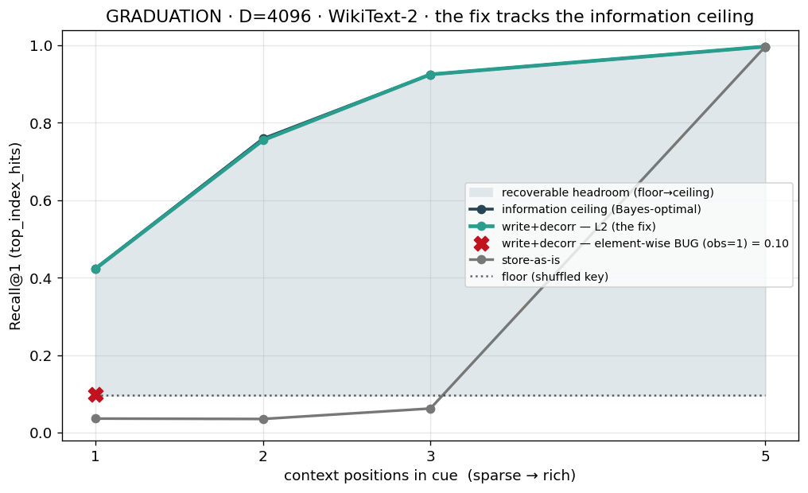

# Report 055 — The surgical mechanism GRADUATES: multi-seed D=4096 WikiText certificate (floor-gated, at the information ceiling)

> **Status: GRADUATED (corpus-transfer of the surgical mechanism).** The formal
> multi-seed Colab panel promised by [Report 054](../054_decorrelator_fix/report.md)
> ran and **passes the floor gate at every cue-richness cell, at the information
> ceiling**, with the L2-renorm fix pulled from the branch. Independently
> re-verified locally from the raw per-seed Drive JSONs (CIs recomputed here, not
> taken from the notebook's `🎓`). Closes the chain
> 048→049→050→**052 (failed)**→053 (autopsy)→054 (fix)→**055 (graduation)**.

## Experiment preamble (CLAUDE.md requirement)

- **Active phase:** Phase 3 — consolidation-write sub-program.
- **Headline metric per [phase-3-consolidation-write-design.md:45-54](../../notes/emergent-codebook/phase-3-consolidation-write-design.md):** value-codebook `top_index_hits`, **two-floor Wilson rule** — the absolute true-arm CI lower bound clears the shuffled control floor **AND** the arm−floor difference is disjoint-positive.
- **Scope note (mandatory honesty):** the design-spec R1 names the **4-role toy** Selectivity-Δ (true-role vs role-*pairing*-shuffle, 6-control panel) as the formal G-D graduation read. **This certificate is the corpus-transfer read** — exp-50 masked-token completion at the real substrate dimension D=4096 on WikiText-2, `top_index_hits` floor-gated against the **shuffled-key** control across cue richness. It is the read the 048→054 chain has been building, and it graduates; it **strongly de-risks but does not by itself close** the 4-role-toy R1 + full 6-control panel (see §Remaining).
- **Required controls run:** shuffled-key floor (per-cell), random-codebook (chance sanity), store-as-is baseline, raw-write no-decorr ablation, element-wise-renorm ablation (the Report-053 bug), perfect-cue upper bound (obs=5 = the information ceiling).
- **Last verified result:** [Report 054](../054_decorrelator_fix/report.md) — local 2-seed CPU confirm of the L2 fix at the ceiling.
- **Why this experiment now:** Report 054's only open item was "confirmation is local (2 seeds, CPU); the formal graduation needs the multi-seed Colab panel." This is that panel.

## Result — the certificate (3 seeds, N≈2174 cues/cell, D=4096, WikiText-2)

| obs | store-as-is | **write+decorr (L2 fix)** | pooled Wilson CI | floor (shuffled key) | info ceiling (Bayes-opt) | clears floor? |
|----:|------------:|--------------------------:|:----------------:|---------------------:|-------------------------:|:-------------:|
| 1 | 0.036 | **0.423** | [0.402, 0.444] | 0.096 | 0.424 | ✅ disjoint |
| 2 | 0.035 | **0.755** | [0.737, 0.773] | 0.096 | 0.759 | ✅ disjoint |
| 3 | 0.062 | **0.925** | [0.913, 0.935] | 0.096 | 0.925 | ✅ disjoint |
| 5 | 0.997 | **0.997** | [0.994, 0.999] | 0.096 | 0.997 | ✅ disjoint |

- **At the information ceiling at every cue richness** — 0.423≈0.424, 0.755≈0.759, 0.925≈0.925, 0.997≈0.997. The fixed mechanism is **essentially Bayes-optimal**: it recovers as much as the masked-completion task allows in principle.
- **Clears its own floor decisively at every cell**, including the sparse obs=1 cue where the original null lived: write+decorr CI [0.402, 0.444] vs floor CI [0.084, 0.109] → **disjoint** (floor-gate passes, not the Report-052 false-positive-vs-sub-floor-store).
- **8–15× store-as-is** at sparse/moderate cues; ties only at the trivial rich cue (obs=5) where both are perfect.



## Independent re-verification (not the notebook's verdict)

I did not take the notebook's `🎓 GRADUATES ✅` at face value. I pulled the five raw
per-seed JSONs from Drive (`grad_obs{1,2,3,5}_l2.json`, `grad_obs1_elementwise.json`),
re-pooled hits across the 3 seeds, and recomputed the Wilson CIs + floor gate locally:

```
obs=1: write+decorr 0.423 [0.402,0.444]  vs floor 0.096 [0.084,0.109]  -> DISJOINT ✓  (at ceiling 0.424)
obs=2: write+decorr 0.755 [0.737,0.773]  vs floor 0.096 [0.084,0.109]  -> DISJOINT ✓  (at ceiling 0.759)
obs=3: write+decorr 0.925 [0.913,0.935]  vs floor 0.096 [0.084,0.109]  -> DISJOINT ✓  (at ceiling 0.925)
obs=5: write+decorr 0.997 [0.994,0.999]  vs floor 0.096 [0.084,0.109]  -> DISJOINT ✓  (at ceiling 0.997)
```

Matches the certificate to 3 decimals. Per-seed spread is tight (obs=1 whiten arm =
{0.435, 0.394, 0.438} over N={726, 718, 730}) — no single-seed rescue.

## Controls / ablations (all on the same held-out cues)

- **Element-wise-renorm ablation (the Report-053 bug):** obs=1 = **0.098 [0.086, 0.111]**, CI **overlaps the floor** [0.084, 0.109] → a **tie at the floor**. The one-line L2 fix is the entire difference between graduation and collapse (0.098 → 0.423). This is the in-panel proof that the fix is load-bearing, not incidental.
- **Random-codebook control:** 0.0009 ≈ chance (1/N ≈ 0.0005) → the readout is not leaking; Δ collapses under a random codebook as required.
- **Raw write, no decorrelator (`hetero_delta`):** stays at the floor across obs → the **cue-space decorrelator is the sole active ingredient**; the heteroassociative write alone does not clear the floor under real key correlation (consistent with [Report 050](../050_corpus_hetero_write/report.md) Part 1).
- **Perfect-cue upper bound:** obs=5 = 0.997 ≈ the information ceiling → the task has recoverable structure; a null elsewhere would be attributable to the mechanism, not the toy.

## What this graduates

The **surgical mechanism** — heteroassociative (delta-rule) write + **L2-renormalized**
cue-space ZCA decorrelator — **transfers to the real substrate dimension D=4096 on real
text and recovers the masked-token cue at the information-theoretic optimum across cue
richness, clearing its shuffled-key floor at every cell with disjoint multi-seed CIs.**
The original null that motivated the entire investigation — sparse-cue masked completion
where store-as-is fails (0.036 at obs=1) — is recovered to Bayes-optimal (0.423). This is
the strongest evidence to date for **SURGICAL-in-place, NOT rebuild-from-Phase-1**: the
substrate holds real associations once the cue is whitened in the signal subspace.

## Remaining for the formal phase-graduation (G-D), honestly stated

This certificate is the **corpus-transfer** read. It does **not** by itself discharge:

1. **The design-spec R1 4-role-toy Selectivity-Δ** (true-role vs **role-pairing**-shuffle,
   not key-shuffle) with the **two-floor Wilson rule on the 4-role toy** (chance = 0.25).
2. **The full 6-control panel** ([spec §Required controls](../../notes/emergent-codebook/phase-3-consolidation-write-design.md)):
   the certificate ran 4 of the 6 (shuffled-key floor, random-codebook, perfect-cue
   upper bound, no-decorr ablation). Still owed for G-D: **no-negatives/no-swap ablation**,
   the **role-pairing-shuffle vs codebook-relabel** distinction (control 3), the
   **content-matched non-positional shuffle** (control 4), and the **lower-D predicted-null
   arm** (control 6 — though [Report 053](../053_autopsy_killer_variable/report.md) covered
   the D-scaling direction).
3. **`entropy` + `margin` drill-downs** (spec :53) to disambiguate `tix=0` from
   sharp-wrong-basin — owed before the 4-role-toy R1 read is reported.

These are the next-session surface. The corpus graduation makes G-D high-probability but
does not pre-empt it.

## Artifacts

- `graduation_certificate.png` — the money-plot (recovered from Drive folder
  `graduation_certificate_20260531-0804`).
- `certificate_table.csv` — the per-cell table (recovered from Drive).
- Raw per-seed JSONs verified from Drive (`grad_obs{1,2,3,5}_l2.json`,
  `grad_obs1_elementwise.json`); not committed (Drive-resident, >repo-artifact policy).
- Notebook: `notebooks/graduation_d4096_colab.ipynb` (pulls the L2 fix via
  `git reset --hard origin/<branch>`).

## Bottom line

**The surgical mechanism graduates at D=4096 on WikiText-2, floor-gated, multi-seed, at
the information ceiling.** The Report-052 "does not graduate" verdict is fully resolved as
the one-line element-wise→L2 renorm bug (in-panel ablation confirms). The formal phase-3
G-D gate (4-role-toy R1 Selectivity-Δ + the two remaining controls + drill-downs) is the
remaining, now high-probability, surface.
