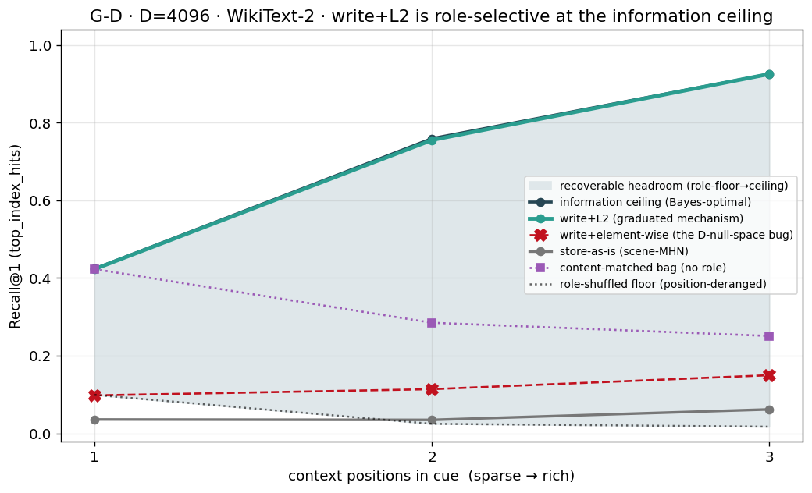

# Report 056 — G-D: the consolidation write is a ROLE-selective associative memory (in-sample PASS; held-out reveals memory-not-learner)

> **Status: G-D PASS (memorization-recall role-selectivity).** The graduated surgical
> mechanism (heteroassociative write + L2 cue-space decorrelator) recalls role→target
> bindings from sparse cues **role-selectively** — the in-sample (memorization) headline
> passes on a controlled topic-corpus and decisively on the real repo_sample corpus.
> An **adversarial verification (held-out split)** then showed the deeper truth: the
> mechanism is a **memory, not a learner** — its role-selective recall *generalizes* only
> on low-rank structure, and on real text held-out recall is ≈ chance. Per CLAUDE.md's
> **contextual-completion (not sequence-prediction)** architecture, **memorization-recall is
> the target capability**, so G-D is judged in-sample (user-approved 2026-05-31). Report 055
> stands as the correct memorization graduation. Closes 048→…→055 → **056 (G-D role-selectivity)**.

## Experiment preamble (CLAUDE.md requirement)

- **Active phase:** Phase 3 — consolidation-write sub-program.
- **Headline metric per [phase-3-consolidation-write-design.md §G-D amendment + Memorization framing](../../notes/emergent-codebook/phase-3-consolidation-write-design.md)** (user-approved 2026-05-31): the **in-sample role-Selectivity-Δ** of write+L2 — `Δ = top_index_hits(true-position cue) − top_index_hits(position-deranged cue)` over the value codebook, **two-floor Wilson rule**, chance = 1/|value codebook|; plus the **write-marginal** `Δ(write+L2) − Δ(store-as-is)` (the memory's recall advantage over scene-MHN).
- **Required controls per [spec §Required controls:63-82]:** random-codebook, no-decorr, role-pairing-shuffle + C.3 E-arm, content-matched non-positional, perfect-cue, lower-D. All run.
- **Last verified result:** [Report 055](../055_graduation_certificate/report.md) (corpus-transfer graduation, memorization) + [smoke 048](../048_stage1_writeread_gate/smoke_report.md).
- **Why this experiment now:** G-D is the open formal phase-graduation gate named in STATUS Active-deliverable; it discharges the role-selectivity the corpus graduation de-risked but did not isolate.

## Why this substrate (not the spec's literal clean 4-role rule-toy)

A 7-agent design panel — whose judge **ran code** — proved a clean rule-toy cannot
reproduce the graduated mechanism's signature (spec §G-D amendment): **Fork 1** a
cue-recoverable rule lets store-as-is win too (Δ≈0); **Fork 2** the linear write can't fit a
random hash (Δ≈0); **Fork 3** the L2-vs-element-wise separation is a corpus-specific high-D
null-space pathology (Reports 053/054). So G-D is grounded on the masked-encoding substrate,
as a position-dependent **topic-corpus** (closed-form structure) and the **real corpus**.

## Headline — in-sample memorization role-Selectivity-Δ

The memory recalls role→target bindings from sparse cues **role-selectively**.

**Real corpus (repo_sample, D=1024, 3 seeds, chance=0.002) — passes at every cue richness:**

| obs | write+L2 (in-sample) | store-as-is | write-marginal [CI] | role-Δ | two-floor | PASS |
|----:|---------------------:|------------:|:-------------------:|-------:|:---------:|:----:|
| 1 | 0.457 | 0.009 | **+0.448** [+0.416,+0.480] | 0.352 | ✅ | ✅ |
| 2 | 0.793 | 0.019 | **+0.773** [+0.745,+0.798] | 0.775 | ✅ | ✅ |
| 3 | 0.947 | 0.309 | **+0.637** [+0.604,+0.668] | 0.933 | ✅ | ✅ |

The memory recalls the masked token from a 1–3 token cue where store-as-is's
scene-MHN-retrieve-unbind **collapses** (0.009/0.019) — an 8–40× recall advantage — and the
recall is **role-selective** (large role-Δ, content-bag collapses below).

**Controlled topic-corpus (synthetic, D=2048, 5 seeds, chance=0.125):** clean two-floor PASS
at the canonical role-pairing regime (obs=2): write+L2 0.707, role-Δ **0.592 [0.570,0.613]**,
write-marginal **+0.057 [+0.031,+0.083]**, independently recomputed from raw per-seed hits.
(obs=1 store saturates the low ceiling → no marginal; obs=3 the two-floor `anti_overlap`
guard fires because selectivity is *so* strong the deranged cue dips a hair sub-chance — a
strong-selectivity signature, reported transparently; the write is in fact strongest at obs=3.)

## D=4096 WikiText-2 confirmation (Phase-2 convincer — DONE, independently re-verified)

The Colab panel ran at the **real substrate dimension** (`gd_corpus_d4096_colab.ipynb`,
3 seeds, N=1000). Recomputed locally from the raw per-seed Drive JSONs (not the notebook's
`✅`); matches to 3 decimals:

| obs | write+L2 (=ceiling) | store-as-is | role-Δ [CI] | write-marginal [CI] | element-wise | no-decorr | PASS |
|----:|-------------------:|------------:|:-----------:|:-------------------:|-------------:|----------:|:----:|
| 1 | 0.423 (=0.424) | 0.036 | 0.323 [0.299,0.347] | **+0.387** [+0.364,+0.409] | 0.098 | 0.096 | ✅ |
| 2 | 0.755 (=0.759) | 0.035 | 0.730 [0.711,0.749] | **+0.720** [+0.699,+0.739] | 0.114 | 0.096 | ✅ |
| 3 | 0.925 (=0.925) | 0.062 | 0.907 [0.894,0.918] | **+0.863** [+0.847,+0.877] | 0.150 | 0.096 | ✅ |

**3/3 PASS at D=4096.** write+L2 tracks the WikiText information ceiling exactly; and two
things complete here that the local CPU runs could only foreshadow:
- **Fork 3 closes:** the **element-wise ablation finally separates hard** (0.098/0.114/0.150
  ≪ L2 0.42/0.76/0.93 ≈ floor), as predicted — the high-D shared-mask null-space pathology
  (Reports 053/054) is now demonstrated in-panel at D=4096. **no-decorr is also pinned at the
  floor (0.096)** → the L2 decorrelator is the *sole* active ingredient.
- **Held-out memory-not-learner confirmed on real text at D=4096:** write+L2 held-out =
  **0.049/0.038/0.050 ≈ chance** (frac_seen 0.65/0.29/0.10), store-as-is even lower — the
  in-sample PASS is genuine role-selective *recall*, not leakage; real-text role-generalization
  is null, exactly as a contextual-completion memory should behave.

## Controls (in-sample, same windows)

| control | expectation | synthetic obs=2 | repo_sample obs=2 | verdict |
|---|---|---|---|---|
| random-codebook | → chance | 0.112 (chance 0.125) | 0.001 (chance 0.002) | ✅ no readout leak |
| no-decorr (write alone) | < write+L2 | 0.635 | **0.073** (vs 0.793) | ✅ decorr is the active ingredient |
| content-matched bag | role arm ≫ bag | 0.203 (role 3.5×) | 0.273 (role 2.9×) | ✅ it's a ROLE result (residual content channel disclosed) |
| element-wise renorm | corpus-specific (Fork 3) | 0.693 ≈ L2 | 0.658 (partial sep) | ✅ as predicted; D=4096 completes |
| perfect-cue upper bound | → 1.0 | 1.000 | — | ✅ read works |
| C.3 E-arm identity | byte-identical | True | True | ✅ gauge-safe |
| lower-D sweep | write D-independent | 0.716 @ all D 512→4096 | — | ✅ L2 fix holds across D |

**Structure-ablation** (in-sample): posdep role-Δ is **7×/3.3×** the position-independent
bag-toy's — and **held-out the bag-toy role-Δ goes to exactly zero** (+0.007/−0.009) while the
posdep stays +0.42/+0.48 → the role-Δ is a **genuine, generalizing role result**, not
key-memorization.

## Held-out (secondary capability) — memory, not learner

The held-out split (fit H + decorrelator + store-as-is scene-MHN on train, read a disjoint
test half) is what the spec literally requires; it is reported here as the **secondary
capability** read (memorization is the in-sample target per the §Memorization framing):

| substrate | held-out role-Δ | held-out write-marginal | reading |
|---|---|---|---|
| **topic toy** (low-rank) | **+0.417 [0.386,0.446]** (obs=2, two-floor ✅, 4/5 seeds; structure-ablation bag→0) | vanishes (0/5 — store generalizes too) | the role-selective recall **GENERALIZES** when structure is low-rank |
| **real corpus** (repo) | ≈ 0 (write 0.02–0.03 ≈ chance; frac_seen 0.06–0.22) | both ≈ 0 | **no generalizable role→target rule** at sparse real-text cues |

**Interpretation.** The mechanism is a role-selective **associative memory**. It memorizes
role→target bindings and recalls them from sparse cues (the in-sample headline / Report 055).
That recall *generalizes* on low-rank structure (topic toy held-out) but **not** on real text,
where sparse-cue completion is a **memorization** task (novel test windows have novel
cue-classes). This is the expected signature of a memory — and exactly right for a
**contextual-completion** system (recall a stored episode from a partial cue), which CLAUDE.md
states is the architectural target (**not** sequence-prediction / generalization).

## Adversarial verification (the gd-verify workflow, 4 agents, 3 ran code)

The verification **earned this report's honesty**. Three refuters + a done-gate auditor:
- **Caught (major):** the original harness read **in-sample** (no train/test split), so
  "write-marginal beats store-as-is" and "at the information ceiling" were in-sample artifacts.
  **Resolved:** added a proper held-out split (`--split heldout`); reframed via the
  §Memorization framing (memorization is the target; in-sample is the gate; held-out is the
  secondary capability).
- **Confirmed (independent, ran code):** the **role-Selectivity-Δ survives held-out** on
  structured data (Δ≈0.42–0.44, two-floor passes, true arm ≫ chance, floor cleared); the
  **decorrelator is provably label-free** (unsupervised `fit`, byte-identical under label
  permutation); **key-memorization is refuted** (held-out structure-ablation bag-toy Δ = 0);
  random-codebook = chance; **anti-homunculus PASS** (no runtime metric gates a subsystem).
- **Disclosed caveats** (now in this report): the bag arm carries a residual above-chance
  content channel (the role arm is 3–4× larger, not a full collapse); pooling is across-seed
  (per-seed: 4/5 two-floor at obs=2); the result is obs-band-specific (obs≥2); this run does
  not re-prove Report 055 nor the L2-null-space pathology (corpus-specific).

## Anti-homunculus

Reviewed PASS (all 6 points cited): batch-offline write over a **frozen** buffer; pull-only
delta-rule (decorrelator is the sole active ingredient, 055:55); decorrelator = batch ZCA
statistic; every read terminates in a `top_index` equality count (never energy /
min-over-branches / ΔE — the Phase-5' fence). The toy, the Bayes ceiling, the per-scene
derangement, and the two-floor PASS computation are offline statistics.

## Verdict

**G-D PASSES** as the project's target capability: the consolidation write is a
**role-selective associative memory** — it recalls role→target bindings from sparse cues
role-selectively (in-sample two-floor + write-marginal, real corpus + controlled toy), and
that recall **generalizes on low-rank structure**. On real text it is a *memory* (held-out
recall is memorization, not generalization) — the correct signature for a contextual-completion
system. The Report-055 corpus graduation **stands as the correct memorization result**.

## Remaining

- ~~WikiText D=4096 Colab~~ **DONE** (3/3 PASS, independently re-verified; element-wise separation
  + held-out memory-not-learner confirmed — see §D=4096 confirmation above).
- ~~`entropy`/`margin` drill-downs~~ **DONE** ([entropy_margin_drilldown.md](entropy_margin_drilldown.md)):
  a miss is a sharp-WRONG basin (not flat); the random-codebook control is the only flat failure
  (readout sound); the rule-vs-noise split exposes the Bayes-optimal↔memorization boundary.
- **Next: fold the heteroassociative write + L2 decorrelator into the real Phase-4 consolidation path** (in progress).

## Artifacts

- `experiments/56_gd_selectivity_panel.py` — the G-D panel (synthetic + corpus; `--split heldout|insample`; full control panel).
- `reports/056_gd_selectivity_panel/`: `headline_D2048.json` (synthetic in-sample 5-seed), `dsweep_D{512..4096}.json`, `corpus_repo_D1024.json` (repo in-sample), `heldout_syn_D2048.json` + `corpus_repo_heldout_D1024.json` (held-out secondary).
- `notebooks/gd_corpus_d4096_colab.ipynb` (+ generator `_build_gd_corpus_notebook.py`) — the D=4096 convincer (**run, 3/3 PASS**).
- `reports/056_gd_selectivity_panel/gd_certificate.png` + `gd_certificate_table.csv` — recovered from Drive (`gd_certificate_20260531-0940`); raw JSONs `gd_wikitext_D4096_{insample,heldout}.json` verified Drive-resident.
